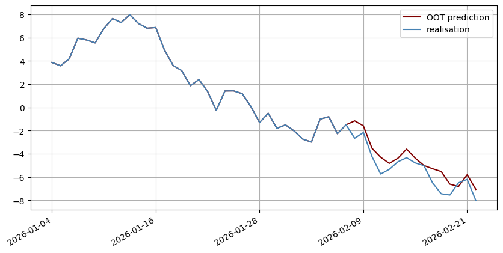
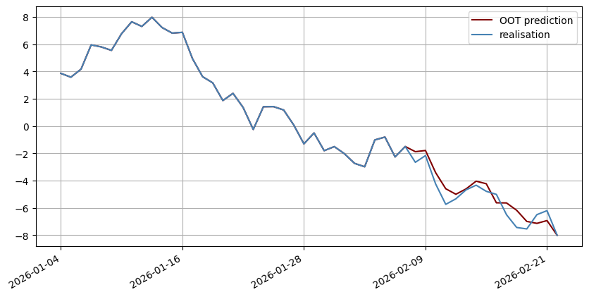

ec_factory
===================

**Author & Maintainer:** Jakub Kulesz  

Overview
--------
A Python package containing classes that enable estimation and forecasting with different variants of the error correction models.

Dependencies
------------
To run `cointegration_models`, the following Python libraries are required:

- `pandas >= 2.1.1`  
- `numpy >= 1.26.0`
- `statsmodels >= 0.14.0` 

### Example usage
Calculations are intended only to show how to estimate and forecast with the models implemented. The specifications of the presented models has not been verified.

#### Loading the library


```python
from ecm_factory import (
    ECM,
    TECM,
    MTECM
)
```

#### Loading basic libraries and creation of a sample dataset for example purposes


```python
import pandas as pd
import numpy as np
import statsmodels.api as sm
import matplotlib.pyplot as plt
import matplotlib.dates as mdates

np.random.seed(42)
dates = pd.date_range(start=pd.Timestamp.today(), periods = 50, freq='D')
trend = np.cumsum(np.random.randn(len(dates)))
y  = trend + np.random.normal(3.30,  0.20, len(dates))
x1 = trend + np.random.normal(0.10,  0.90, len(dates))
x2 = trend + np.random.normal(-1.20, 0.90, len(dates))
data = pd.DataFrame({'y': y[:-15], 'x1': x1[:-15], 'x2': x2[:-15]}, index=dates[:-15])
data_predictions = pd.DataFrame({'y': y[-15:], 'x1': x1[-15:], 'x2': x2[-15:]}, index=dates[-15:])
```

#### Fitting the ECM
The simplest form in which the sets of variables in the long-run and short-run equations are the same.


```python
model_ecm = ECM().fit(X = data[['x1', 'x2']], y = data['y'])
print(model_ecm.model.summary())
```

                                     OLS Regression Results                                
    =======================================================================================
    Dep. Variable:                    d_y   R-squared (uncentered):                   0.653
    Model:                            OLS   Adj. R-squared (uncentered):              0.620
    Method:                 Least Squares   F-statistic:                              19.49
    Date:                Sun, 04 Jan 2026   Prob (F-statistic):                    2.74e-07
    Time:                        12:46:06   Log-Likelihood:                         -30.436
    No. Observations:                  34   AIC:                                      66.87
    Df Residuals:                      31   BIC:                                      71.45
    Df Model:                           3                                                  
    Covariance Type:            nonrobust                                                  
    ================================================================================
                       coef    std err          t      P>|t|      [0.025      0.975]
    --------------------------------------------------------------------------------
    coint_vector    -0.7234      0.185     -3.903      0.000      -1.101      -0.345
    d_x1             0.2941      0.072      4.077      0.000       0.147       0.441
    d_x2             0.3872      0.075      5.169      0.000       0.234       0.540
    ==============================================================================
    Omnibus:                        0.976   Durbin-Watson:                   1.606
    Prob(Omnibus):                  0.614   Jarque-Bera (JB):                0.860
    Skew:                          -0.124   Prob(JB):                        0.651
    Kurtosis:                       2.262   Cond. No.                         3.66
    ==============================================================================
    
    Notes:
    [1] R² is computed without centering (uncentered) since the model does not contain a constant.
    [2] Standard Errors assume that the covariance matrix of the errors is correctly specified.
    

#### Forecasts with the ECM
Single initial observations are needed.


```python
predictions_ecm = model_ecm.predict(
    data_predictions,
    data.iloc[-1, :],
    data['y'].iloc[-1]
    )

fig, ax = plt.subplots(figsize=(10, 5))
plt.plot(dates, y[:-15].tolist() + predictions_ecm, color = 'maroon', label= 'OOT prediction')
plt.plot(dates, y, color = 'steelblue', label = 'realisation')
plt.xticks(dates[::12])
ax.xaxis.set_major_formatter(mdates.DateFormatter('%Y-%m-%d'))
fig.autofmt_xdate()
plt.legend()
plt.grid(True)
```


    

    


#### Fitting the T-ECM
A configuration in which there is only one variable in the long-term equation.


```python
model_tecm = TECM(longterm = ['x1']).fit(data[['x1','x2']], data['y'])
print(model_tecm.model.summary())
```

                                     OLS Regression Results                                
    =======================================================================================
    Dep. Variable:                    d_y   R-squared (uncentered):                   0.667
    Model:                            OLS   Adj. R-squared (uncentered):              0.595
    Method:                 Least Squares   F-statistic:                              9.327
    Date:                Sun, 04 Jan 2026   Prob (F-statistic):                    1.20e-05
    Time:                        12:46:06   Log-Likelihood:                         -29.785
    No. Observations:                  34   AIC:                                      71.57
    Df Residuals:                      28   BIC:                                      80.73
    Df Model:                           6                                                  
    Covariance Type:            nonrobust                                                  
    =================================================================================
                        coef    std err          t      P>|t|      [0.025      0.975]
    ---------------------------------------------------------------------------------
    coint_vector+    -0.8363      0.226     -3.698      0.001      -1.299      -0.373
    coint_vector-    -0.1532      0.214     -0.716      0.480      -0.592       0.285
    d_x1+             0.4883      0.152      3.213      0.003       0.177       0.800
    d_x1-             0.2528      0.128      1.980      0.058      -0.009       0.514
    d_x2+             0.1064      0.131      0.811      0.424      -0.163       0.375
    d_x2-             0.3115      0.105      2.967      0.006       0.096       0.527
    ==============================================================================
    Omnibus:                        4.356   Durbin-Watson:                   1.957
    Prob(Omnibus):                  0.113   Jarque-Bera (JB):                2.115
    Skew:                          -0.313   Prob(JB):                        0.347
    Kurtosis:                       1.951   Cond. No.                         3.72
    ==============================================================================
    
    Notes:
    [1] R² is computed without centering (uncentered) since the model does not contain a constant.
    [2] Standard Errors assume that the covariance matrix of the errors is correctly specified.
    

#### Forecasts with the T-ECM
Single initial observations are needed.


```python
predictions_tecm = model_tecm.predict(
    data_predictions,
    data.iloc[-1, :],
    data['y'].iloc[-1]
    )

fig, ax = plt.subplots(figsize=(10, 5))
plt.plot(dates, y[:-15].tolist() + predictions_tecm, color = 'maroon', label= 'OOT prediction')
plt.plot(dates, y, color = 'steelblue', label = 'realisation')
plt.xticks(dates[::12])
ax.xaxis.set_major_formatter(mdates.DateFormatter('%Y-%m-%d'))
fig.autofmt_xdate()
plt.legend()
plt.grid(True)
```


    

    


#### Fitting the MT-ECM
A configuration in which there is only one variable in the short-term part.


```python
model_mtecm = MTECM(shortterm = ['x2']).fit(data[['x1','x2']], data['y'])
print(model_mtecm.model.summary())
```

                                     OLS Regression Results                                
    =======================================================================================
    Dep. Variable:                    d_y   R-squared (uncentered):                   0.509
    Model:                            OLS   Adj. R-squared (uncentered):              0.441
    Method:                 Least Squares   F-statistic:                              7.513
    Date:                Sun, 04 Jan 2026   Prob (F-statistic):                    0.000279
    Time:                        12:46:06   Log-Likelihood:                         -35.750
    No. Observations:                  33   AIC:                                      79.50
    Df Residuals:                      29   BIC:                                      85.49
    Df Model:                           4                                                  
    Covariance Type:            nonrobust                                                  
    =================================================================================
                        coef    std err          t      P>|t|      [0.025      0.975]
    ---------------------------------------------------------------------------------
    coint_vector+    -0.8144      0.341     -2.388      0.024      -1.512      -0.117
    coint_vector-    -0.2373      0.272     -0.871      0.391      -0.794       0.320
    d_x2+             0.4278      0.128      3.338      0.002       0.166       0.690
    d_x2-             0.4809      0.120      4.024      0.000       0.236       0.725
    ==============================================================================
    Omnibus:                        1.677   Durbin-Watson:                   1.928
    Prob(Omnibus):                  0.432   Jarque-Bera (JB):                0.679
    Skew:                          -0.224   Prob(JB):                        0.712
    Kurtosis:                       3.541   Cond. No.                         3.33
    ==============================================================================
    
    Notes:
    [1] R² is computed without centering (uncentered) since the model does not contain a constant.
    [2] Standard Errors assume that the covariance matrix of the errors is correctly specified.
    

#### Forecasts with the MT-ECM
Two initial observations are needed.


```python
predictions_mtecm = model_mtecm.predict(
    data_predictions,
    data.iloc[-2:, :],
    data['y'].iloc[-2:]
    )

fig, ax = plt.subplots(figsize=(10, 5))
plt.plot(dates, y[:-15].tolist() + predictions_mtecm, color = 'maroon', label= 'OOT prediction')
plt.plot(dates, y, color = 'steelblue', label = 'realisation')
plt.xticks(dates[::12])
ax.xaxis.set_major_formatter(mdates.DateFormatter('%Y-%m-%d'))
fig.autofmt_xdate()
plt.legend()
plt.grid(True)
```


    

    

